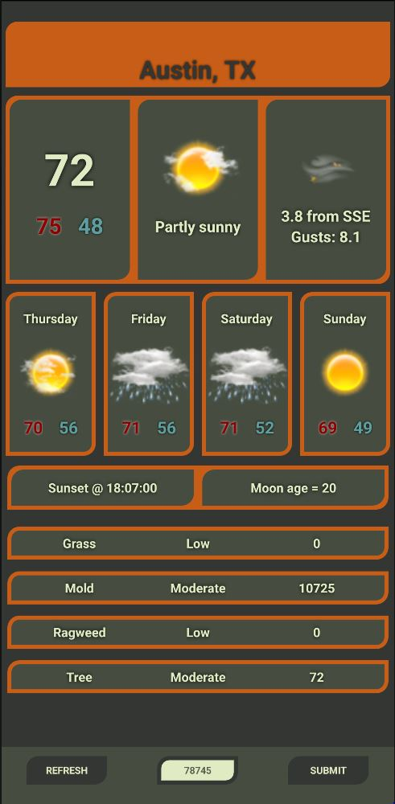

# the-what
> Using accuweather's api and react-native this mobile application delivers the weather to the user, current & forecasted, from the provided US postal zip code.

# the-why
> The goal of this project was to learn more flexibile codebases for mobile development & to have a customized weather app that matches my personal needs (not riddled with ads).

# the-when
> It's usable in its state, but barebones. The plan is to integrate more dynamically-customizable options leveraging new features from react-native. 
